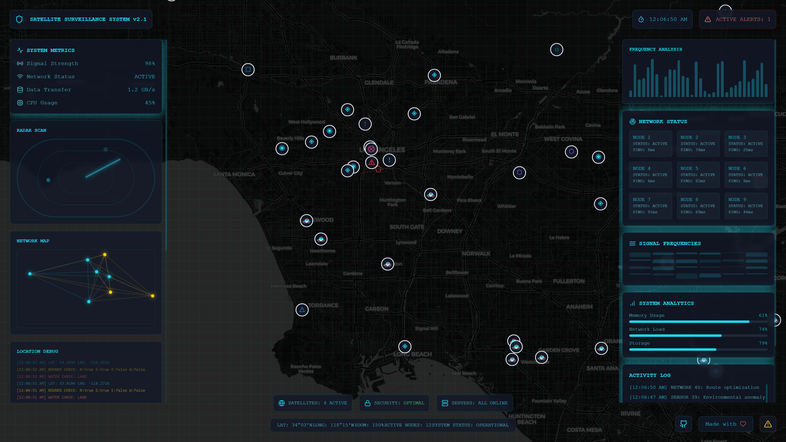

# Cyber Patrol Dashboard

<div align="center">

[](https://reactjs.org/)
[](https://www.typescriptlang.org/)
[](https://vitejs.dev/)
[](https://tailwindcss.com/)
[](./LICENSE)

### 🌐 [Live Demo](https://cyber-patrol-dashboard.vercel.app) | [GitHub](https://github.com/MegalithOfficial/cyber-patrol-dashboard)

</div>

<div align="center">
  
</div>

⚠️ **DISCLAIMER: This is a fictional project created for demonstration purposes only. It does not connect to or represent any real security systems, law enforcement agencies, or surveillance networks.**

A fictional real-time cybersecurity visualization dashboard that simulates police patrols, security alerts, and network activity across a virtual representation of Los Angeles County. This project demonstrates modern web technologies and interactive visualization techniques through an engaging sci-fi inspired interface.

## About This Demo

This is a creative visualization project that:
- Simulates a futuristic security monitoring system
- Uses fictional data and randomly generated events
- Creates an engaging sci-fi inspired user interface
- Demonstrates modern web development techniques
- Is not connected to any real-world security systems or data

## Features

- 🚓 Simulated police patrol visualization with dynamic movement patterns
- 🎯 Fictional security incidents and alerts
- 🌐 Simulated network activity with connection visualization
- 🗺️ Interactive map interface with stylized dark mode view
- 📊 Demo metrics and system status monitoring
- 🔄 Dynamic location updates and activity logging
- 🚨 Multi-type alert system demonstration

## Technology Stack

- **Frontend Framework**: React 18 with TypeScript
- **Map Visualization**: Leaflet with React-Leaflet
- **Styling**: TailwindCSS
- **Icons**: Lucide React
- **Build Tool**: Vite

## Getting Started

### Prerequisites

- Node.js (v18 or higher)
- npm or yarn

### Installation

1. Clone the repository:
   ```bash
   git clone https://github.com/MegalithOfficial/cyber-patrol-dashboard.git
   cd cyber-patrol-dashboard
   ```

2. Install dependencies:
   ```bash
   npm install
   # or
   yarn install
   ```

3. Start the development server:
   ```bash
   npm run dev
   # or
   yarn dev
   ```

4. Open your browser and navigate to `http://localhost:5173`

## Project Structure

```
src/
├── components/         # React components
│   ├── PoliceVehicle.tsx
│   ├── RunawayArea.tsx
│   ├── SatelliteView.tsx
│   └── ...
├── hooks/             # Custom React hooks
│   └── useDynamicLocations.ts
├── types/             # TypeScript type definitions
│   └── locations.ts
├── data/             # Static data and configurations
│   └── laLocations.ts
└── App.tsx           # Main application component
```

## Features in Detail

### Police Patrol System
- Minimum of 5 police units actively patrolling
- Dynamic movement patterns with realistic patrol areas
- Real-time location updates and status monitoring
- Unique identification and tracking for each unit

### Security Monitoring
- Real-time tracking of security incidents
- Multi-level alert system
- Connection visualization between security nodes
- Activity logging and history

### Map Interface
- Dark mode satellite view
- Interactive controls for navigation
- Dynamic grid overlay
- Real-time updates and animations

## Contributing

1. Fork the repository
2. Create your feature branch (`git checkout -b feature/AmazingFeature`)
3. Commit your changes (`git commit -m 'Add some AmazingFeature'`)
4. Push to the branch (`git push origin feature/AmazingFeature`)
5. Open a Pull Request

## License

This project is licensed under the MIT License - see the [LICENSE](LICENSE) file for details.

## Acknowledgments

- Map tiles provided by [CartoDB](https://carto.com/)
- Icons by [Lucide](https://lucide.dev/)
- Built with [React](https://reactjs.org/) and [Vite](https://vitejs.dev/) 